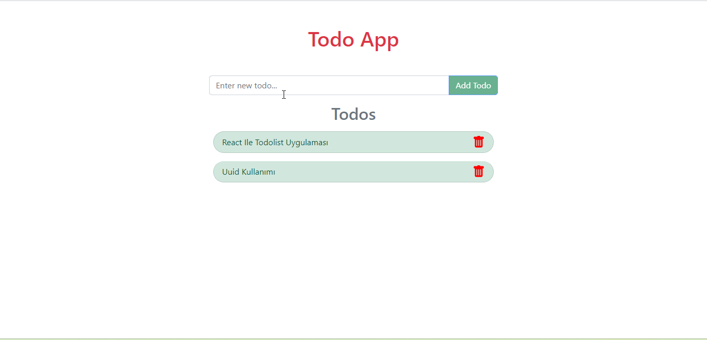

# ToDo-App-React

## Description

Project aims to create a Todo App.

## Project Skeleton

```
004 - Todo App(folder)
|
|----readme.md         # Given to the students (Definition of the project)
SOLUTION
├── public
│     └── index.html
├── src
│    ├── components
│    │       ├── Header.jsx
│    │       │   
│    │       ├── TodoList.jsx         
│    ├── App.js
│    ├── index.js
│    └── index.css
├── package.json
└── yarn.lock
```

## Expected Outcome



## Objective

Build a Todo App using ReactJS.

### At the end of the project, following topics are to be covered;

- HTML

- CSS

- JS

- ReactJS


